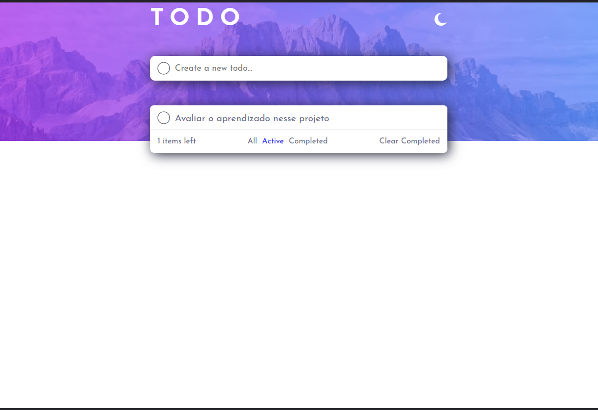

 

# TODO APP - Frontend Mentor

 

 

 

 

 

Este foi o quarto projeto da mentoria **Conquiste Sua Vaga** foi chamado de projeto desafiador, onde deveriamos testar ao máximo nossos limites e conhecimentos, o projeto que escolhi foi inspirado no desafio do Frontend Mentor que era a criação de um Todo app.

## Sumário

- [Overview](#overview)
  - [O Desafio](#O-Desafio)
  - [Screenshot](#screenshot)
- [Meu processo](#Meu-processo)
  - [Stacks utilizadas](#Stacks-utilizadas)
  - [O que aprendi](#O-que-aprendi)
  - [Desenvolvimento Contínuo](#Desenvolvimento-Contínuo)
- [Author](#author)
- [Agradecimentos](#Agradecimentos)

## Overview

### O Desafio

- O desafio era criar um TODO App

- Ter a opção de tema claro ou escuro

- Ver o layout ideal para a interface, dependendo do tamanho da tela do dispositivo

- Tarefa bônus: usuário pode arrastar uma TODO da lista para organizar na ordem que quiser.

 

### **Screenshot - Desktop - Dark and Light theme**

 

### **Screenshot - Mobile - Dark and Light theme**

## Meu processo

- Selecionar o projeto a ser realizado

- Após selecionar o projeto e ter alguns problemas com a stack inicial, foram 3 mudanças até a stack que foi utilizada, optei por utilizar _HTML5, SASS/SCSS, React, Redux e JavaScript_, sempre pensando em otimizar o desenvolvimento e aprendizado com a aplicação

- Foram realizados alguns wireframes de como seria toda a estrutura do projeto

- Recriei o template do Frontend Mentor usando o Figma

- Iniciar o desenvolvimento do código na seguinte ordem, html, css e por último as funcionalidades javascript + react + redux

### Stacks utilizadas

      

- [x] HTML5 Semântico
- [x] SCSS | CSS Flexbox
- [x] JavaScript
- [x] React
- [x] Redux

### O que aprendi

- Aprendi a utilizar o redux, com os reducers e a store, nunca havia utilizado porém a sua documentação é extensa e de fácil entendimento, existem diversos exemplos tambem no youtube e github.

- Aplicar o conceito de que menos é mais e que nem sempre precisamos componentizar tudo.

- Aprendi uma nova forma de implementar CSS, utilizando o SASS/SCSS e de forma aninhada.

- Uma grande melhoria na gestão desse projeto ao utilizar o método pomodoro

### Desenvolvimento Contínuo

Algumas melhorias já estão mapeadas para próxima release, são as seguintes:

- [x] Implementado um scroll com a barra personalizada na todo list
- [ ] Implementar a função drag and drop na todo list
- [ ] Adicionar a funcionalidade de editar
- [ ] Adicionar a persistência de dados no localstorage

## Author - Diego Girão

 

## Agradecimentos

Meu muito obrigado aos mentores **Pedro Marins e Henrique Andrade**, assim como os tutores e meus colegas da turma 23c e da comunidade **Code** no geral, vocês são excelentes e estão sempre dispostos a ajudar, parabéns a todos os envolvidos.
